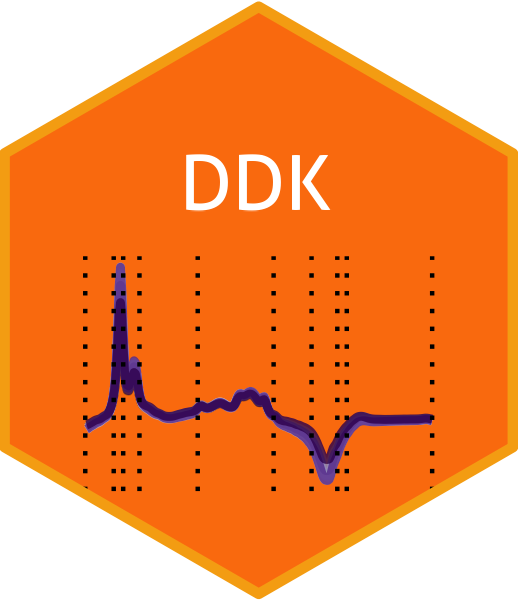

<!-- # DDK <a href='https://github.com/ranibasna/ddk/'></a> -->

[](/commits/master)

# Data driven orthogonal basis selection for functional data analysis

<!-- badges: start -->
<!-- badges: end -->
<!-- You'll still need to render `README.Rmd` regularly, to keep `README.md` up-to-date. `devtools::build_readme()` is handy for this. You could also use GitHub Actions to re-render `README.Rmd` every time you push. An example workflow can be found here: <https://github.com/r-lib/actions/tree/master/examples>. -->
<!-- In that case, don't forget to commit and push the resulting figure files, so they display on GitHub and CRAN. -->

This is an R implementation for the data driven orthogonal basis
selection for functional data analysis paper. For more details see [the
arxiv link](https://arxiv.org/pdf/2103.07453.pdf) for the paper, Machine
Learning Assisted Orthonormal Basis Selection for Functional Data
Analysis.

In this work, we propose machine learning style techniques for the
placement of the knots. The chosen knots are used to build orthogonal
splines basis functions *f*<sub>*k*</sub>(*t*), *k* = 1, ..., *K* that
are used in basis function expansion to convert the data from discrete
recorded data into a functional one. The method address the problem of
the choice of the initial functional basis selection for functional data
analysis.

# DKK algorithm

## Installation

You can install the development version from
[GitHub](https://github.com/ranibasna/ddk) with:

``` r
# install.packages("devtools")
devtools::install_github("ranibasna/ddk")
```
